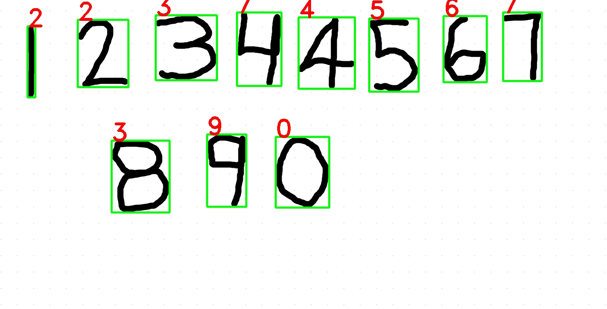
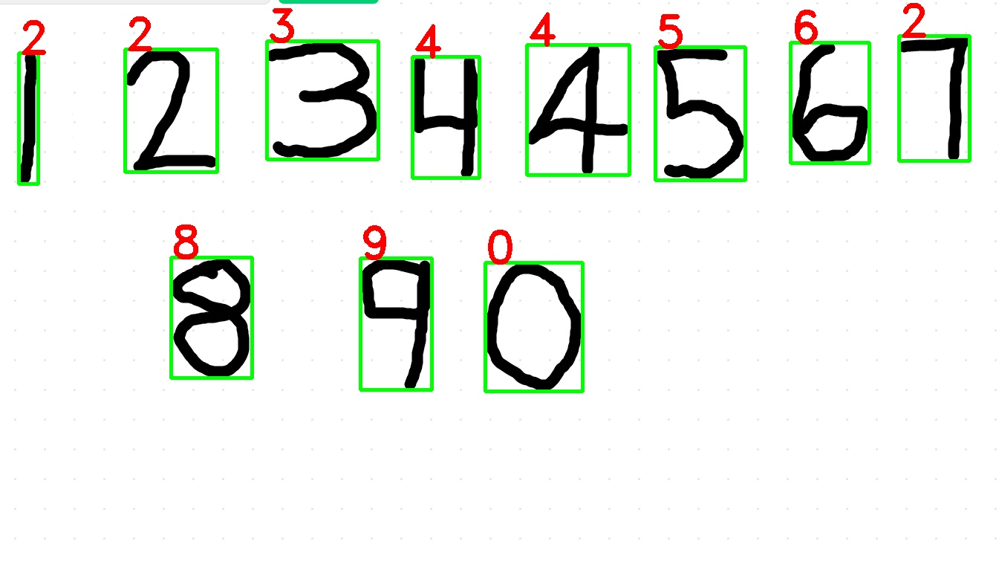
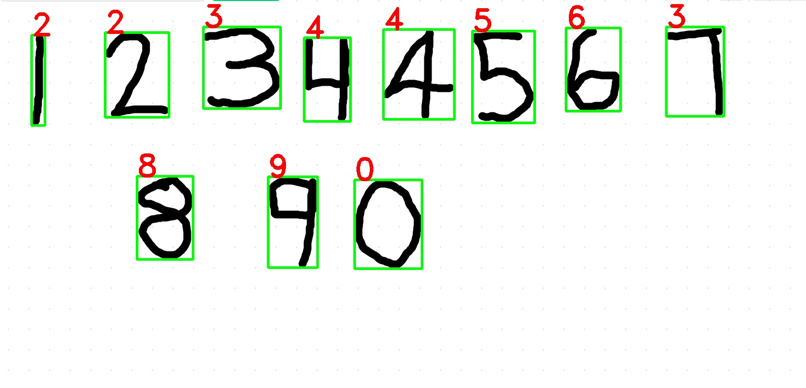
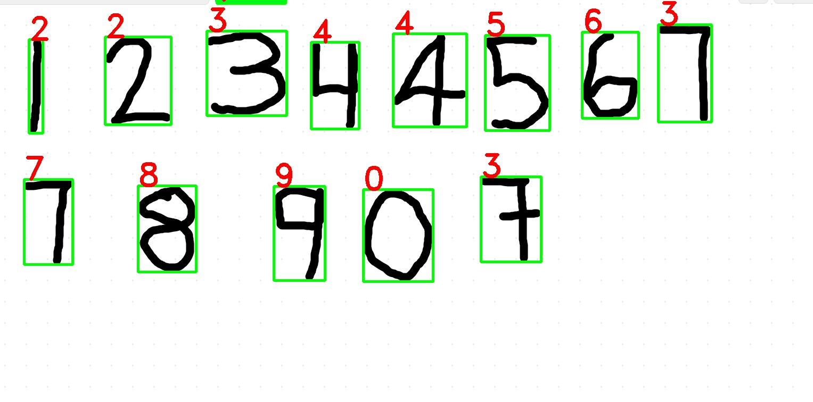

# handwritten-digit-detector
In This Project , It is a detect a real handwritten digits using python , OpenCV and tensorflow-keras. 
this is also working for real time and image based script. 
 
Accuracy : 97.3%</b>
 
You can clone this project and run it. 
 
this project is also contain some image and video which you can run and check it. 
 
All vidoes file is available in Video folder and Images are available in Image folder. 
 
Result of Image and Video are also available in resultimage and resultvideo folder respectivily. 
 
you can run realtimedetection.py file and check it using video and testscript.py for image. 
 
type command in terminal 
 
<code>python3 realTimedetection.py</code> 
 
<code>python3 testscript.py</code> 
 

<b>Result Image</b>

